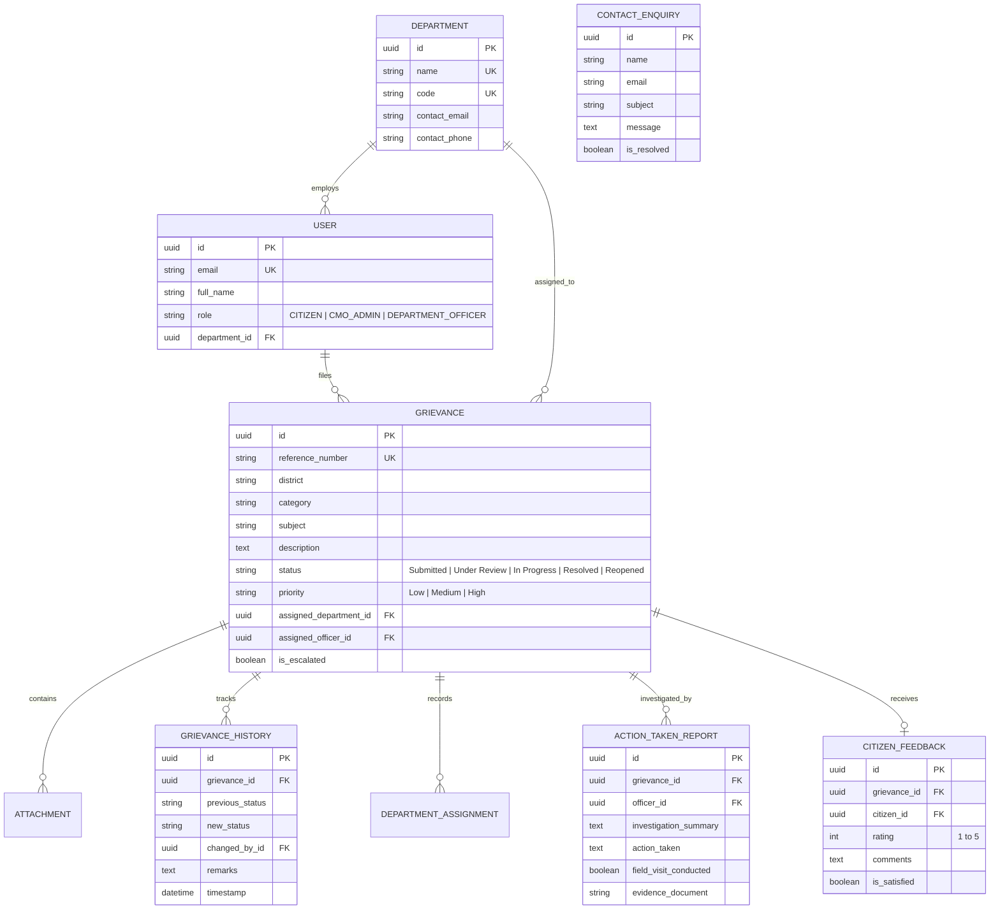

# 03 — Database Design

### Entity-Relationship Diagram

```mermaid
erDiagram
    USER ||--o{ GRIEVANCE : "files"
    DEPARTMENT ||--o{ USER : "employs"
    DEPARTMENT ||--o{ GRIEVANCE : "assigned_to"
    GRIEVANCE ||--o{ ATTACHMENT : "contains"
    GRIEVANCE ||--o{ GRIEVANCE_HISTORY : "tracks"
    GRIEVANCE ||--o{ DEPARTMENT_ASSIGNMENT : "records"
    GRIEVANCE ||--o{ ACTION_TAKEN_REPORT : "investigated_by"
    GRIEVANCE ||--o| CITIZEN_FEEDBACK : "receives"

    USER {
        uuid id PK
        string email UK
        string full_name
        string role "CITIZEN | CMO_ADMIN | DEPARTMENT_OFFICER"
        uuid department_id FK
    }

    DEPARTMENT {
        uuid id PK
        string name UK
        string code UK
        string contact_email
        string contact_phone
    }

    GRIEVANCE {
        uuid id PK
        string reference_number UK
        string district
        string category
        string subject
        text description
        string status "Submitted | Under Review | In Progress | Resolved | Reopened"
        string priority "Low | Medium | High"
        uuid assigned_department_id FK
        uuid assigned_officer_id FK
        boolean is_escalated
    }

    GRIEVANCE_HISTORY {
        uuid id PK
        uuid grievance_id FK
        string previous_status
        string new_status
        uuid changed_by_id FK
        text remarks
        datetime timestamp
    }

    ACTION_TAKEN_REPORT {
        uuid id PK
        uuid grievance_id FK
        uuid officer_id FK
        text investigation_summary
        text action_taken
        boolean field_visit_conducted
        string evidence_document
    }

    CITIZEN_FEEDBACK {
        uuid id PK
        uuid grievance_id FK
        uuid citizen_id FK
        int rating "1 to 5"
        text comments
        boolean is_satisfied
    }

    CONTACT_ENQUIRY {
        uuid id PK
        string name
        string email
        string subject
        text message
        boolean is_resolved
    }
```
